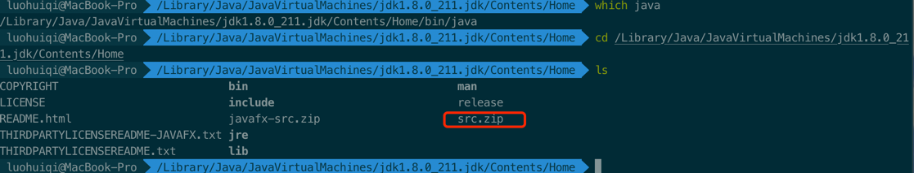
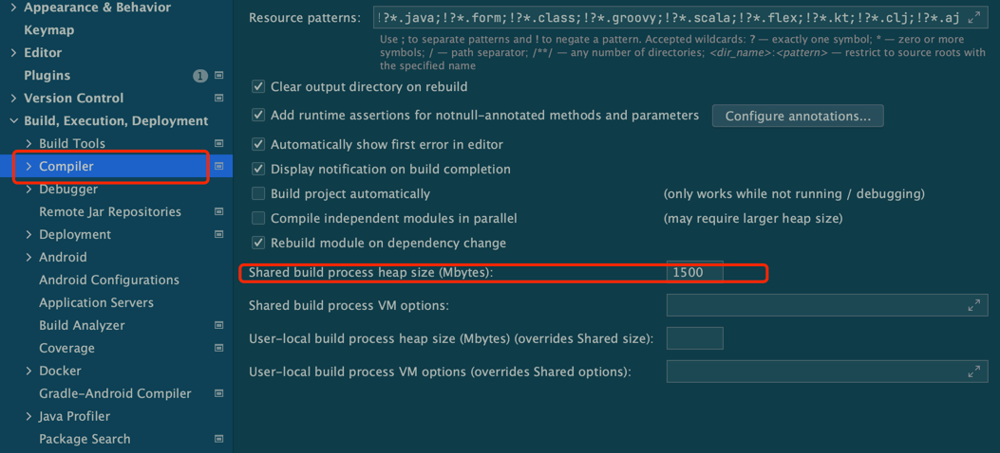
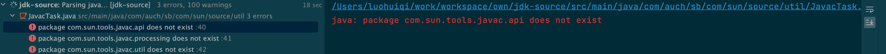
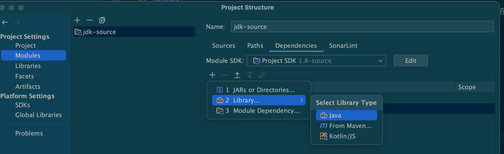
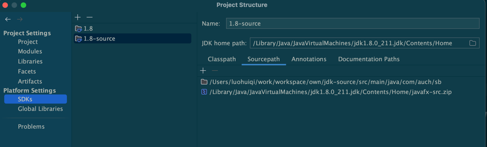
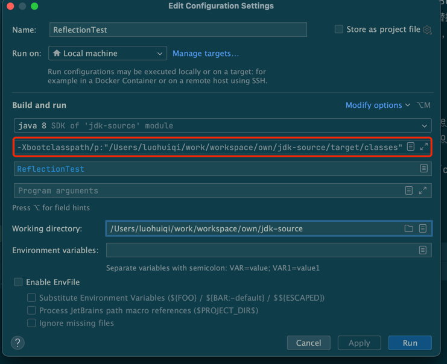
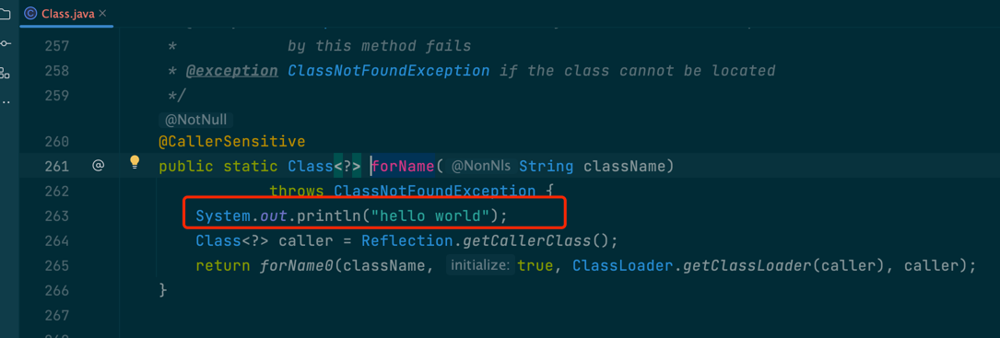
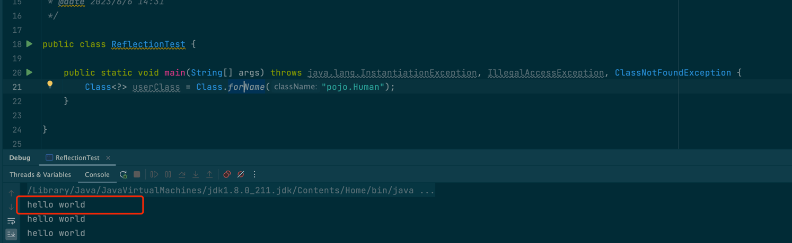

# jdk源码阅读环境搭建（可自由添加注释，修改代码并dubug)

## 环境搭建

使用maven搭建原始框架，pom如下

```xml
<?xml version="1.0" encoding="UTF-8"?>
<project xmlns="http://maven.apache.org/POM/4.0.0"
         xmlns:xsi="http://www.w3.org/2001/XMLSchema-instance"
         xsi:schemaLocation="http://maven.apache.org/POM/4.0.0 http://maven.apache.org/xsd/maven-4.0.0.xsd">
    <modelVersion>4.0.0</modelVersion>

    <groupId>com.auch.sb</groupId>
    <artifactId>jdk-source</artifactId>
    <version>1.0-SNAPSHOT</version>

    <build>
        <plugins>
            <plugin>
                <groupId>org.apache.maven.plugins</groupId>
                <artifactId>maven-compiler-plugin</artifactId>
                <configuration>
                    <source>8</source>
                    <target>8</target>
                </configuration>
            </plugin>
        </plugins>
    </build>
</project>
```


## 添加源码
在jdk安装目录可找到`src.zip`文件，并解压，由于文件较大，建议直接拖动到项目文件夹（不要直接拖在IDE）以及需修改build的堆大小为





### 添加依赖

deploy项目会报缺少依赖错误



添加依赖tool.jar,路径在jdk目录下的lib包下




## 调整类加载顺序

### 1.调整sourcepath,以期加载从此sourcePath开始，顺序很重要，sourcepath必须在javafx-src.zip之前



### 2.调整加载类加载顺序
此时，虽然可以正常debug，但是无法做注释，修改代码等，是由于双亲委派机制（Delegation hierarchy
），加载*Class*是AppClassLoader加载，依此委托ExtClassLoader，BootstrapClassLoader，而BootstrapClassLoader负责加载rt.jar包的class，而不会加载我们添加的src下的文件，
我最开始的想法是在依赖中取除rt.jar包，而后反编译rt.jar包数据，由其替换第二步添加的源码，原则上是可以的，但是由于反编译工具（jadx）版本等的不同，反编译出来的文件由些无法使用，
本来想对不适用的反编译文件，直接从ide 编译的文件替换，然后就替换了3天，还没替换完，还是太naive，以后绝对要杜绝真这中无脑耗时的操作，好了，闲话不多说了，本来想再找找rt.jar的可用的反编译的文件，最后找到了很好解决此痛点的方法，
使用jvm参数**_-Xbootclasspath_**，

|Setting   |  Effect |
|---|---|
| -Xbootclasspath/p:<path>  |  Prepends the specified resources to the front of the bootstrap class path. |
| -Xbootclasspath/a:<path>  | Appends the specified resources to the end of the bootstrap class path.  |

所以，只需要在ide的vm 参数中设置 -Xbootclasspath/p = 【target/class】即可，具体为


```vm
-Xbootclasspath/p:"/Users/luohuiqi/work/workspace/own/jdk-source/target/classes"
```
## 测试






